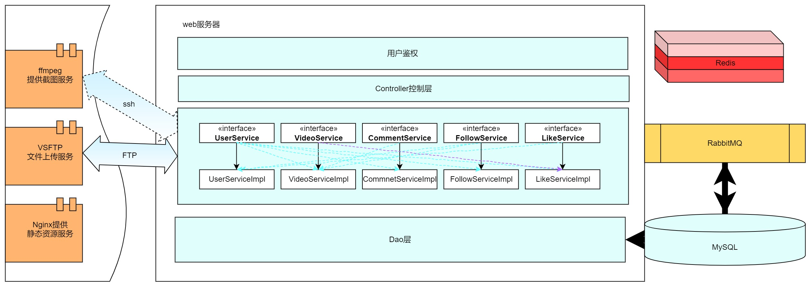
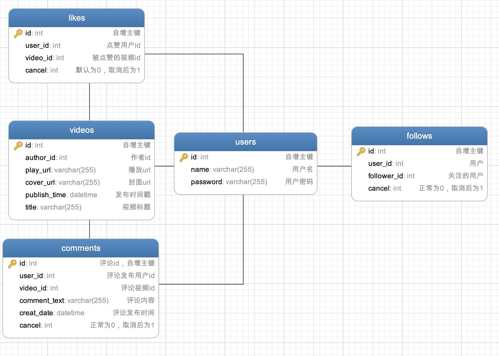
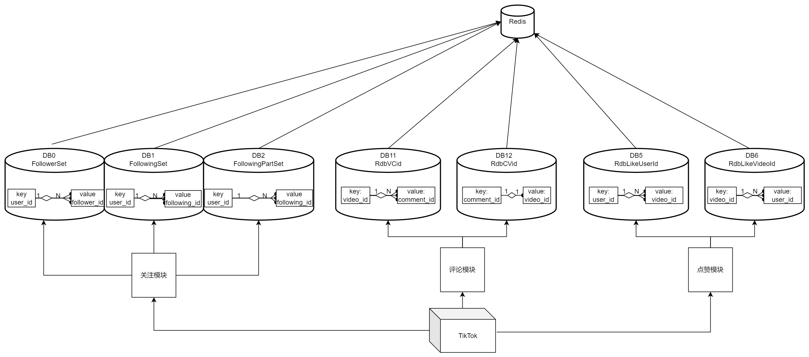
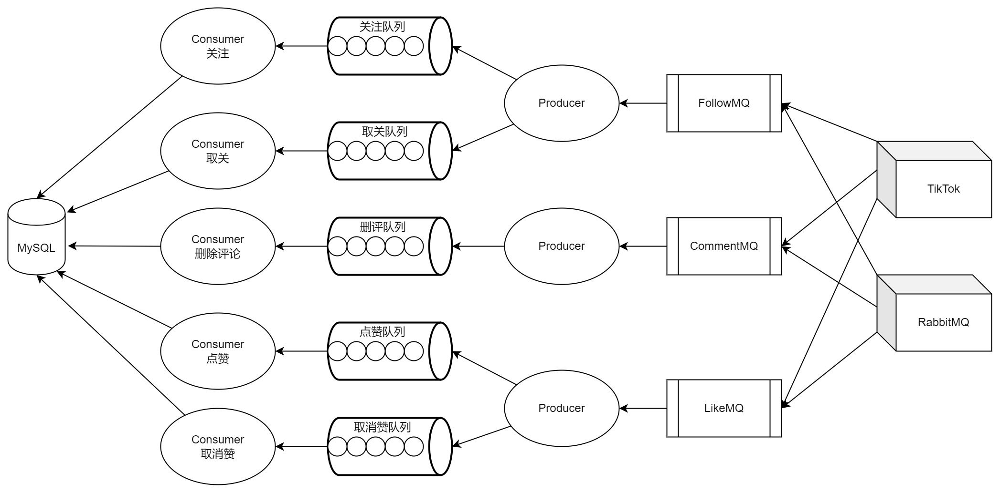
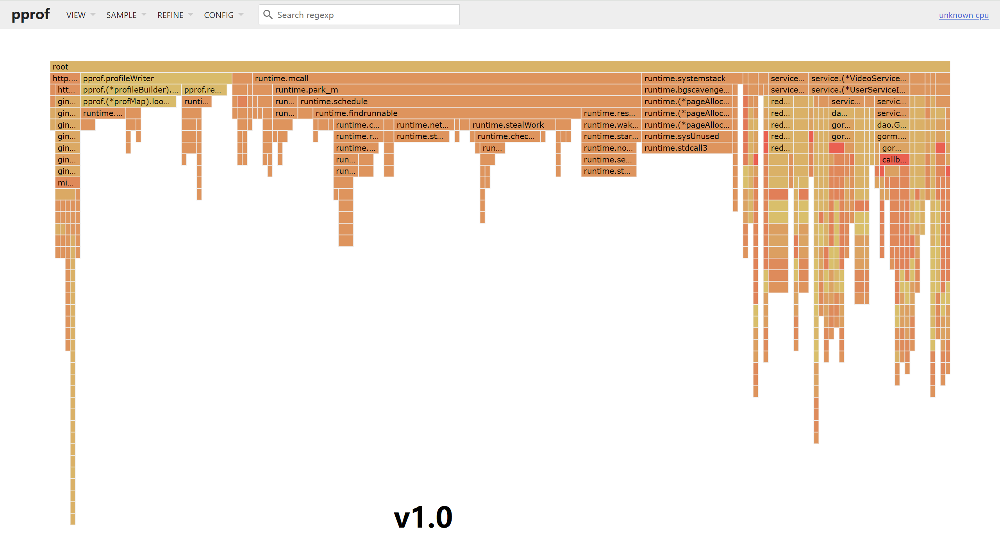
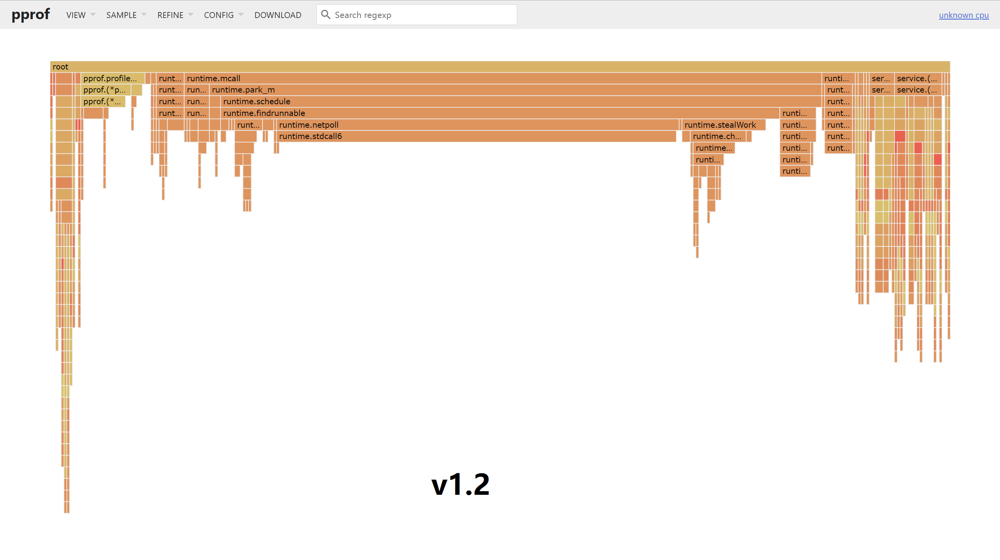

# tiktok

#### 开发前的配置要求

1. go 1.18.1
2. MySQL(数据库sql文件在config包中)
3. 搭建Redis、RabbitMQ环境
4. 配置静态资源服务器：安装Nginx、vsftpd、ffmpeg（相关配置文件在config包中）
5. [最新版抖音客户端软件](https://pan.baidu.com/s/1kXjvYWH12uhvFBARRMBCGg?pwd=6cos)


```sh
git clone https://github.com/VINDA-98/tiktok-study.git
```

### 文件目录说明

```
tiktok 
├── /.idea/
├── /config/ 配置文件包
├── /controller/ 控制器包
├── /dao/ 数据库访问
├── /document/ 敏感词词库
├── /images/ 图片引用
├── /middleware/ 中间件
│   ├── ffmpeg/ 视频截图
│   ├── ftp/ 文件服务器
│   ├── jwt/ 鉴权
│   ├── rabbitmq/ 消息队列
│   ├── redis/ 缓存
├── /service/ 服务层
├── /util/ 工具
├── .gitignore
├── /go.mod/
├── LICENSE
├── main.go
├── README.md
└── router.go
```

### 开发的整体设计
#### 整体的架构图
<p align="center">
  <a href="https://github.com/VINDA-98/tiktok-study.git/">
    
  </a>

#### 数据库的设计
<p align="center">
  <a href="https://github.com/VINDA-98/tiktok-study.git/">
    
  </a>
</p>

#### Redis架构的设计
<p align="center">
  <a href="https://github.com/VINDA-98/tiktok-study.git/">
    
  </a>
</p>

#### RabbitMQ架构的设计
<p align="center">
  <a href="https://github.com/VINDA-98/tiktok-study.git/">
    
  </a>
</p>

#### 服务模块的设计

###### 视频模块的设计
视频模块包括视频Feed流获取、视频投稿和获取用户投稿列表。
详情请阅读[视频模块设计说明](https://bytedancecampus1.feishu.cn/docs/doccntmcunjHSMzVUNEhGbxjxJh) 查阅为该模块的详细设计。

###### 点赞模块的设计
点赞模块包括点赞视频、取消赞视频和获取点赞列表。
详情请阅读[点赞模块设计说明](https://bytedancecampus1.feishu.cn/docs/doccn13iJgTIAebIPpMiRqb0Hwb) 查阅为该模块的详细设计。

###### 关注模块的设计
关注模块包括关注、取关、获取关注列表、获取粉丝列表四个基本功能。
详情请阅读[关注模块的设计说明](https://bytedancecampus1.feishu.cn/docs/doccnOsdm29SufPJkDfRs7tLHgx) 查阅为该模块的详细设计。

###### 用户模块的设计
用户与安全模块包括用户注册、用户登录和用户信息三个部分
详情请阅读[用户模块的设计说明](https://bytedancecampus1.feishu.cn/docs/doccn1vusmV9oN1ukTCyLpbJ46f) 查阅为该模块的详细设计。

###### 评论模块的设计
评论模块包括发表评论、删除评论和查看评论。
详情阅读[评论模块的设计说明](https://bytedancecampus1.feishu.cn/docs/doccnDqfcZJW4tTD409NGlYfvCb) 查阅为该模块的详细设计。

### 性能测试
通过命令 go tool pprof -http=:6060 "http://localhost:9099/debug/pprof/profile?seconds=120" 生成了两个版本的火焰图，左图为v1.0，右图为v1.2版本，通过对比两张详细火焰图，优化后的相同方法调用时间更短（添加了相应的中间件）

<p align="center">
<a href="https://github.com/HammerCloth/tiktok.git/">
    
    
</a>

同时包含各个接口的压力测试，详情请阅读[压测报告](https://bytedancecampus1.feishu.cn/docs/doccnoDHHJ84k94G1I2TxHj9Udh) 获得具体的压力数据。
### 编译项目到linux
```shell
CGO_ENABLED=0 GOOS=linux GOARCH=amd64 go build ./
```

### 使用到的技术
框架相关：
- [Gin](https://gin-gonic.com/docs/)
- [Gorm](https://gorm.io/docs/)

服务器相关：
- [Nginx](https://www.nginx-cn.net/)
- [vsftpd](https://www.linuxfromscratch.org/blfs/view/svn/server/vsftpd.html)
- [ffmpeg](https://ffmpeg.org/documentation.html)
- [goftp](http://t.zoukankan.com/lvdongjie-p-9554849.html)

中间件相关：
- [Redis](https://redis.io/docs/)
- [RabbitMQ](https://www.rabbitmq.com/documentation.html)

数据库：
- [MySQL](https://dev.mysql.com/doc/)